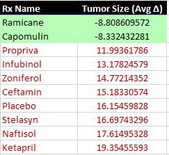
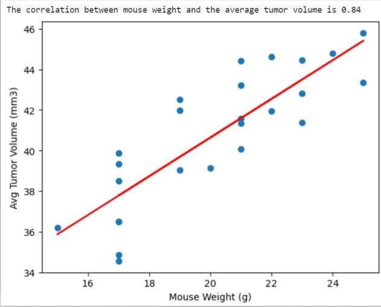
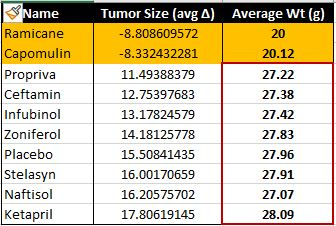
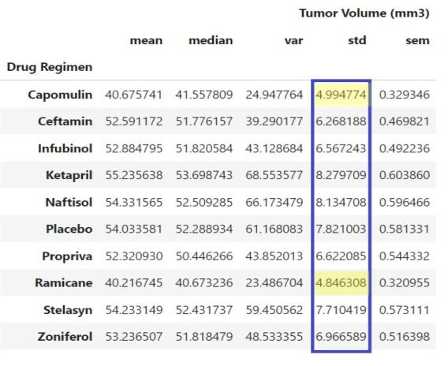

**UCB Data Analysis Module 5**
## Data Visualization Challenge: Analysis of Capomulin Study: 45-day Trial

---------------
#### Purpose:
Process raw data from a pharmaceutical study to determine the performance of a new drug, Capomulin, for the treatment of cancerous tumors in mice. The study also examines 8 competitor drugs marketed for the same treatment as well as a placebo for baseline comparison.  The analysis will either support or disprove Pymaceuticals' claims about the efficacy of Capomulin as a potential cancer treatment.  

---------------
#### Conclusion:
- When viewed from the highest level and colored with the broadest brush stroke, Capomulin outpaced every other drug regimen in the study with the exception of Ramicane. In fact, only two drugs were found to have a beneficial impact on tumor volume.  

- The following figure shows the average delta in tumor volume across all drug regimens from the first measurement until the final measurement for each test subject.  

    

- While the data initially appears conclusive and favorable for Capomulin, it's important to consider all factors that may have contributed to this outcome. One such consideration pertains to the size of the test subjects themselves...our 248 lab mice.  

- A strong correlation exists between the initial size of the mouse and the positive or negative delta of the tumor volume.  

    

- This would be less concerning if the mice were evenly distributed by weight across all drug regimens in the study. However, the data shows that the average weight (in grams) of mice who were treated with Ramicane and Capomulin weighed an average of 7 grams less than the mice who were treated with all other drug regimens.  

    

- Additional testing is needed. It is recommended that precautionary steps be taken to ensure fair distribution of test subjects for the next trial.  

**How consistant is the data? Does it provide a reliable measure of drug efficacy?**  

- The strength of any analysis increases as the number of data points increase. However, based solely upon the data from this 45-day evaluation, it appears that fidelity is low. The standard deviation for tumor volume measurements for each category, including placebo, is approximately 5-8 standard deviations from the mean.

  

NOTE: Upon reaching the section of the analysis for "Quartiles, Outliers and Boxplots" I made the decision to exclude data from the following [4] research subjects: b447, t573, u153, x226.  Each of these subjects was treated with Ceftamin, however only one datapoint was recorded for each mouse.  The instructions indicate to "Calculate the final tumor volume of each mouse across four of the treatment regimens" to show efficacy of the treatment over time.  This is not possible with only one datapoint.  By including the "final" tumor weight for these 4 subjects (which was actually the initial weight prior to the start of treatment) we risk introducing data that could unfairly skew the results one way or another.  In my opinion, it's best to exclude incomplete data that doesn't contribute to our end goal.

--------------
#### Contents of Repository:
1 x Jupyter notebook (pymaceuticals_FINAL.ipynb)  
2 x .csv files (data source for analysis)  
4 x jpg images (also embedded in .ipynb markdown)  
1 x README file

-------------------
#### Contributions:  
Just blood, sweat and tears.

------------------
#### License:
[MIT](https://choosealicense.com/licenses/mit/)

